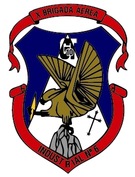
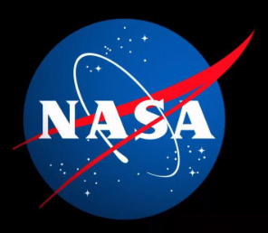
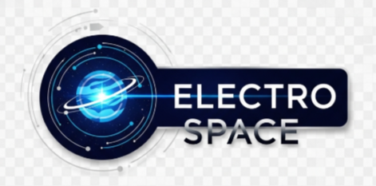
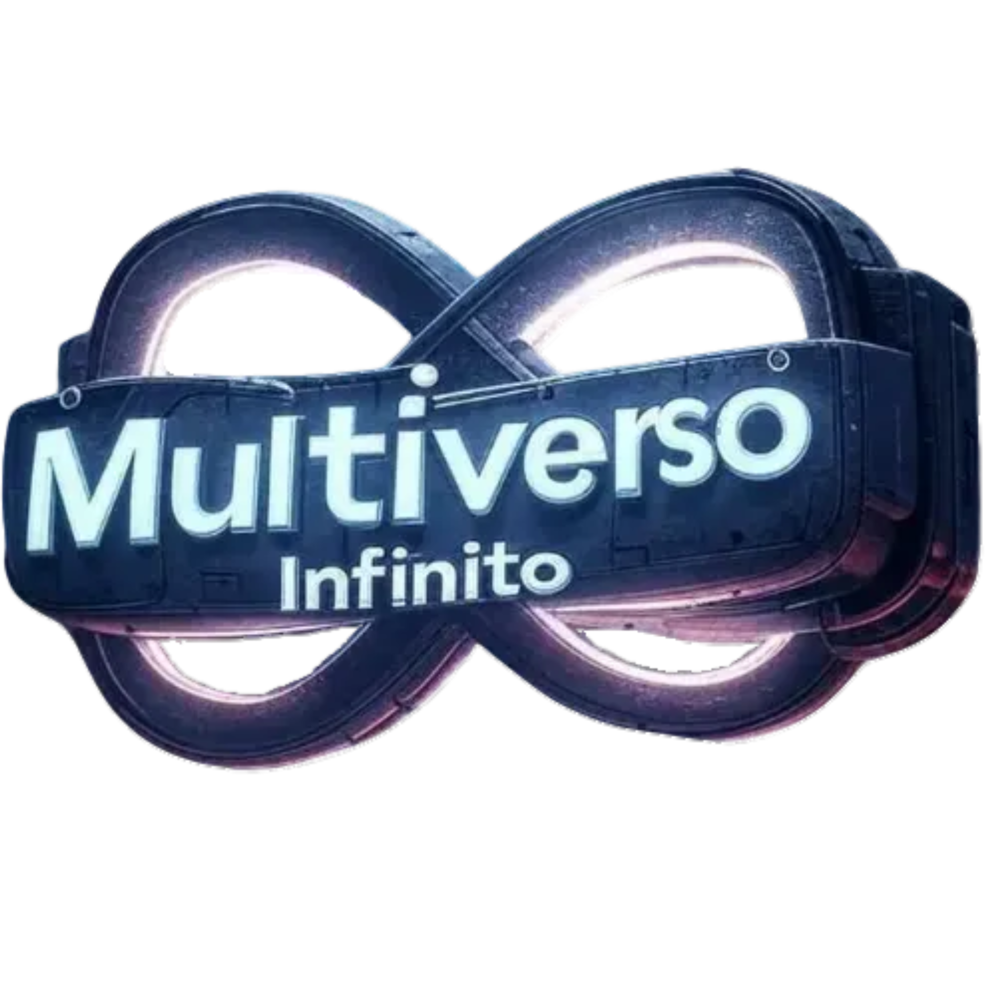
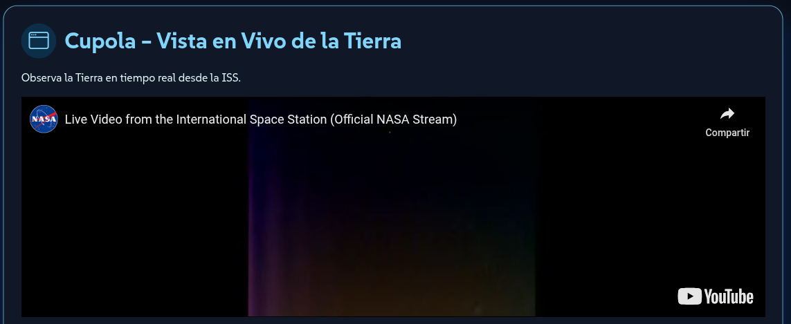
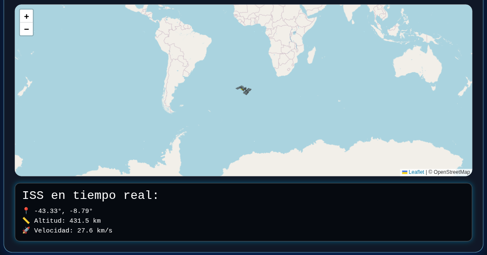

<h1 style="text-align: center;">
  ElectroSpace - ISS 25 Años - NASA Hackathon 2025 - Sede Río Gallegos 🚀
</h1>

<div style="display: flex; justify-content: center; align-items: center; gap: 25px; flex-wrap: wrap; margin-top: 20px;">
  
  
  
  
</div>


## Descripción

**ISS Experience** es una experiencia interactiva que permite explorar la vista desde la **Cupola de la Estación Espacial Internacional (ISS)** y entrenar como astronauta en el **Laboratorio de Flotabilidad Neutra (NBL)**.
El proyecto fue desarrollado como parte del **Hackathon NASA 2025** y busca acercar la investigación espacial a estudiantes y entusiastas mediante simulaciones visuales y contenido educativo.

El sitio incluye:

* Video en vivo desde la ISS.
* Simulación de flotabilidad en el NBL con control de un slider.
* Globo 3D interactivo mostrando la posición de la ISS.
* Información sobre beneficios de la investigación espacial en la Tierra.
* Recursos y enlaces de la NASA.

## Capturas de Pantalla





---

## Tecnologías Utilizadas

| Tecnología                                         | Uso                                         |
| -------------------------------------------------- | ------------------------------------------- |
| HTML5 & CSS3                                       | Estructura y estilo del sitio web           |
| JavaScript                                         | Interactividad y animaciones                |
| [Bootstrap 5](https://getbootstrap.com/)           | Componentes y diseño responsivo             |
| [Bootstrap Icons](https://icons.getbootstrap.com/) | Iconografía en todo el sitio                |
| [Animate.css](https://animate.style/)              | Animaciones de entrada y efecto hover       |
| [tsparticles](https://particles.js.org/)           | Efecto de estrellas en el fondo             |
| [Leaflet](https://leafletjs.com/)                  | Visualización del mapa y posición de la ISS |
| APIs de la NASA                                    | Datos de la ISS y recursos multimedia       |

---

## Instalación y Uso

1. Clonar el repositorio:

```bash
git clone https://github.com/tu-usuario/iss-experience.git
```

2. Abrir el archivo `index.html` en un navegador moderno.

3. ¡Disfrutar de la experiencia!

---

## Contacto

Para consultas o sugerencias: **[nicobutter@gmail.com](mailto:nicobutter@gmail.com)** **[multiversoinfinito@icloud.com](mailto:multiversoinifinito@icloud.com)**


---

## Créditos

* **Hackathon NASA 2025**
* **Equipo:** Ethan, Valentino, Valentina, Axl, Santiago, Nicolás
* **Escuela:** Industrial N6 "X Brigada Aerea"
* **Sponsor** Oficial MultiversoInfinito

---

## Licencia

Este proyecto se distribuye bajo la licencia [MIT](LICENSE).
