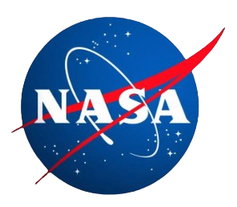
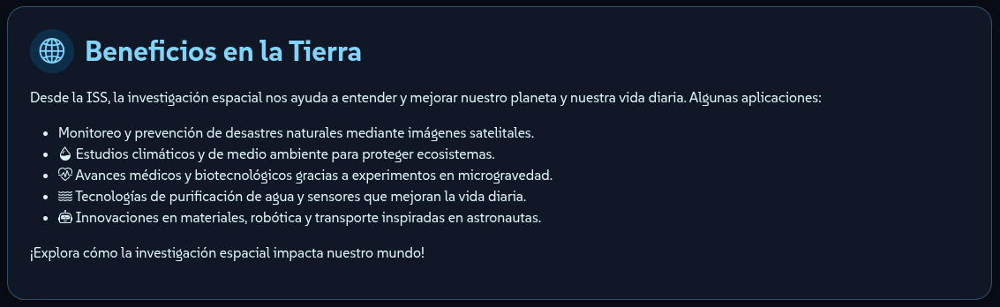

<h1 style="text-align: center;">
  🚀 ElectroSpace - ISS 25 Años - NASA Hackathon 2025 - Sede Río Gallegos
</h1>

<div style="display: flex; justify-content: center; align-items: center; gap: 25px; flex-wrap: wrap; margin-top: 20px;">
  
  
  
  
</div>

---

## 🛰️ Descripción

**ISS Experience** es una experiencia interactiva que permite explorar la vista desde la **Cúpula de la Estación Espacial Internacional (ISS)**, entrenar como astronauta en el **Laboratorio de Flotabilidad Neutra (NBL)** y experimentar la **gravedad cero** a través de un **juego desarrollado en Godot**.

El proyecto fue desarrollado como parte del **NASA Hackathon 2025** en la sede **Río Gallegos**, con el objetivo de acercar la investigación espacial a estudiantes y entusiastas mediante simulaciones visuales, interactividad y contenido educativo.

El sitio incluye:

* 🌍 **Video en vivo** desde la ISS.  
* 🧑‍🚀 **Simulación de flotabilidad** en el NBL con control de intensidad.  
* 🛰️ **Mapa interactivo** mostrando la posición actual de la ISS.  
* 🪐 **Juego 3D en Godot:** simula gravedad cero, realiza caminatas espaciales y observa la Tierra desde la órbita.  
* 🔭 **Información** sobre los beneficios de la investigación espacial en la Tierra.  
* 📡 **Recursos y enlaces** oficiales de la NASA.

---

## 🖼️ Capturas de Pantalla




---

## ⚙️ Tecnologías Utilizadas

| Tecnología                                         | Uso                                         |
| -------------------------------------------------- | ------------------------------------------- |
| **HTML5 & CSS3**                                   | Estructura y estilo del sitio web           |
| **JavaScript**                                     | Interactividad y animaciones                |
| [**Bootstrap 5**](https://getbootstrap.com/)       | Componentes y diseño responsivo             |
| [**Bootstrap Icons**](https://icons.getbootstrap.com/) | Iconografía del sitio                     |
| [**Animate.css**](https://animate.style/)          | Animaciones de entrada y hover              |
| [**tsparticles**](https://particles.js.org/)       | Efecto de estrellas en el fondo             |
| [**Leaflet**](https://leafletjs.com/)              | Visualización del mapa de la ISS            |
| **APIs de la NASA**                                | Datos de la ISS y recursos multimedia       |
| [**Godot Engine**](https://godotengine.org/)       | Juego interactivo de simulación espacial    |

---

## 🚀 Instalación y Uso

1. Clonar el repositorio:

   ```bash
   git clone https://github.com/NicoButter/NASA--HACKATHON
   ```

2. Abrir el archivo `index.html` en un navegador moderno.

3. ¡Explorá el espacio como un astronauta!

---

## 💬 Contacto

📧 [nicobutter@gmail.com](mailto:nicobutter@gmail.com)  
📧 [multiversoinfinito@icloud.com](mailto:multiversoinfinito@icloud.com)

---

## 🎮 Repositorio del Juego (Godot)

🔗 [https://github.com/jujujuujuu/NASA-Hackathon---Indu-6---25-a-os-de-ISS](https://github.com/jujujuujuu/NASA-Hackathon---Indu-6---25-a-os-de-ISS)

---

## 👨‍🚀 Créditos

* **Hackathon NASA 2025**
* **Equipo:** Ethan, Valentino, Valentina, Axl, Santiago, Nicolás, Mayl
* **Escuela:** Industrial N°6 “X Brigada Aérea” 
* **Sponsor oficial:** Multiverso Infinito  

---

## 📄 Licencia

Este proyecto se distribuye bajo la licencia [MIT](LICENSE).
